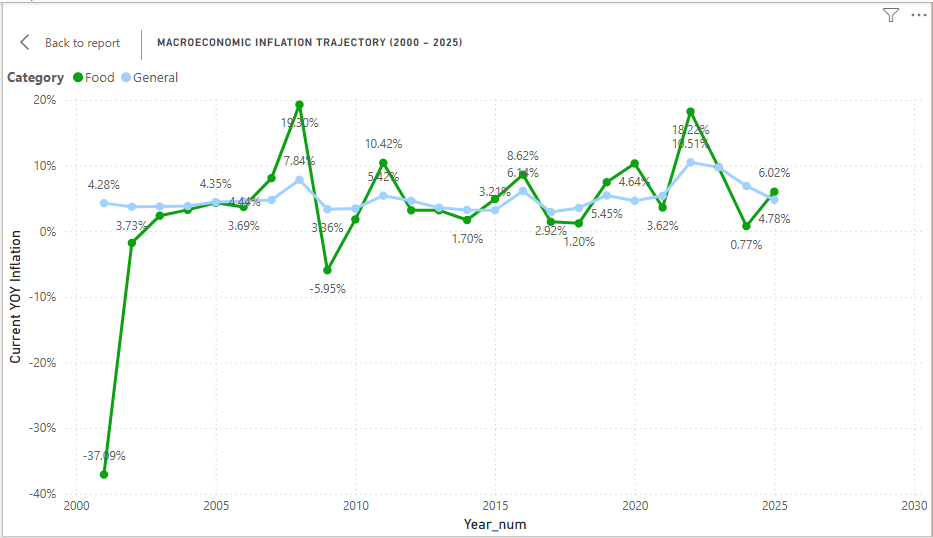
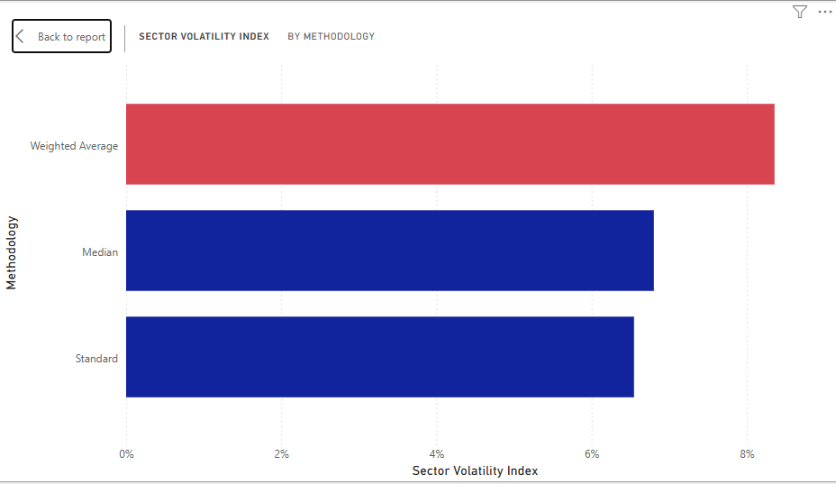
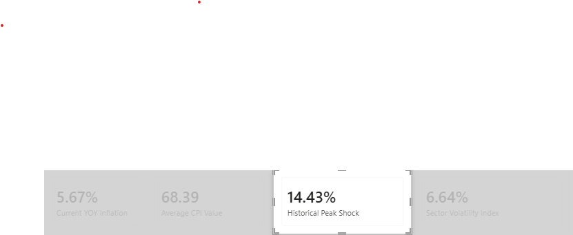

##  DAX Architecture & Rationale

Building enterprise-grade financial dashboards requires moving past simple aggregations into advanced statistical modeling. The engineering logic behind the custom DAX expressions implemented in this model includes:

### 1. State-Preserving Inflation Tracking via Variables (`Current YOY Inflation`)
* **Technical Method:** Leveraged local evaluation storage (`VAR` / `RETURN`) alongside time-series slicing execution (`MAX`).
* **Business Rationale:** Using variables locks the calculation state in memory for the duration of the query. Instead of forcing the Power BI VertiPaq engine to repeatedly compute the `LatestYear` for every row evaluation, the value is calculated once and reused. This drastically optimizes dashboard responsiveness and cross-filtering speed, while the `DIVIDE` function seamlessly handles potential zero-record errors by outputting a clean blank instead of crashing.

### 2. Context-Agnostic Baseline Evaluation (`Prior_Year_CPI`)
* **Technical Method:** Modified database evaluation contexts using `CALCULATE` paired with an overriding `FILTER(ALL(...))` array matrix.
* **Business Rationale:** In standard reporting, clicking a specific calendar year would instantly truncate the data model's view to *only* that year, making comparative trend analysis impossible. By applying `ALL('CPI_TABLE'[Year_num])`, we programmatically force the engine to step outside the user's active filter selection, look backward exactly one year (`LatestYear - 1`), and retrieve historical baselines on the fly.

### 3. Iterative Economic Risk & Dispersion Tracking (`Historical Peak Shock` & `Sector Volatility Index`)
* **Technical Method:** Deployed advanced X-system iterators (`MAXX` and `STDEVX.P`) running over multi-row historical dimensional arrays.
* **Business Rationale:** A simple average completely flattens out economic reality—it fails to tell stakeholders how unstable an asset class is. Implementing `STDEVX.P` measures the exact statistical variance (Standard Deviation) of price swings across years, providing an institutional-grade **Volatility Index** to isolate which economic sectors are highly unstable. Meanwhile, `MAXX` scans the entire chronological timeline to flag the single worst historical price shock, ensuring risk teams know the historical ceiling of market stress.

## VISUALIZATIONS 

###  Question 1: How does global food inflation behave compared to general consumer goods?
* **The Insight:** Food inflation is a highly volatile economic driver compared to the steady baseline of general consumer goods. 
* **The Data Story:** In 2022, global food inflation exploded to a historic high of **18.22%**, while general consumer goods stood at **10.51%**. This dramatic divergence represents severe supply chain gridlocks.

---

###  Question 2: Which tracking methodology exposes our financial models to the highest risk?
* **The Insight:** Index aggregation choices radically alter risk perception. The **Weighted Average** methodology introduces the highest rate of volatility (~8.35%).

---

###  Question 3: What is the single worst historical macroeconomic shock, and what does it tell us?
* **The Insight:** Driven by our `Historical Peak Shock` DAX measure, the system flags **14.43%** as the absolute maximum boundary of cross-sector inflation acceleration.

